.. title::
    Configuración adicional

.. _har-conf-advanced:

#######################
Configuración Adicional
#######################

Activar/Desactivar Servicio
===========================

Desde la barra de menú se puede activar y desactivar el servicio de reconocimiento. Presiona el botón
de acción para elegir ambas opciones.

+----------------------+----------------------+---------------------+ 
| Desactivar Servicio  | Activar el Servicio  | Servicio Activado   | 
+======================+======================+=====================+ 
| |dst_1|              | |act_2|              | |actv_3|            | 
+----------------------+----------------------+---------------------+ 

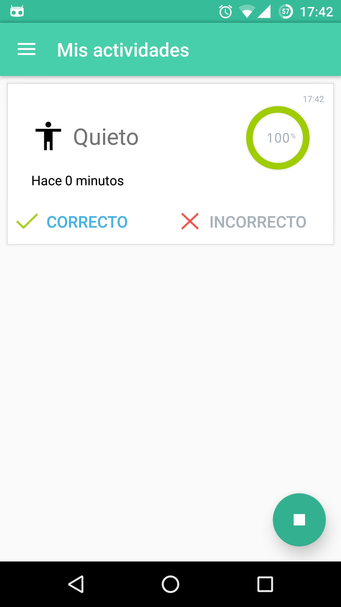

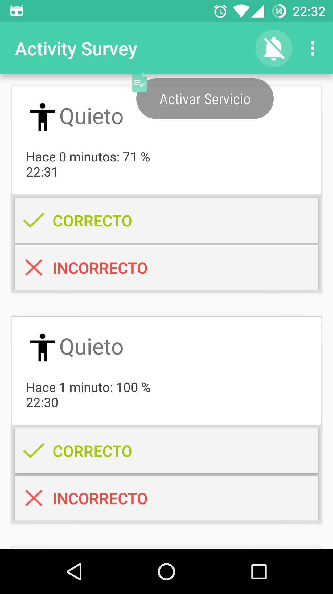

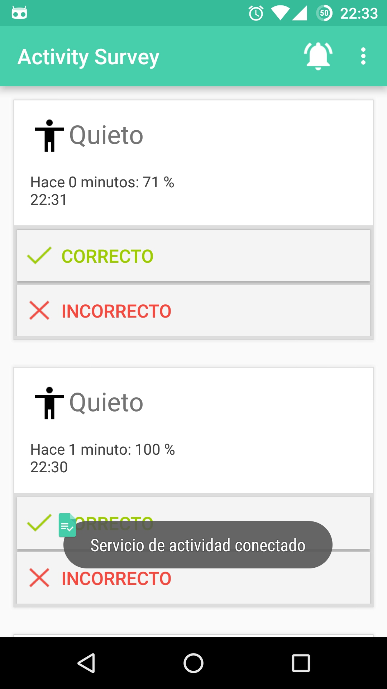

Configuración
=============

Para acceder a la configuración desde la aplicación accedé al ``Menu > Configuración``.

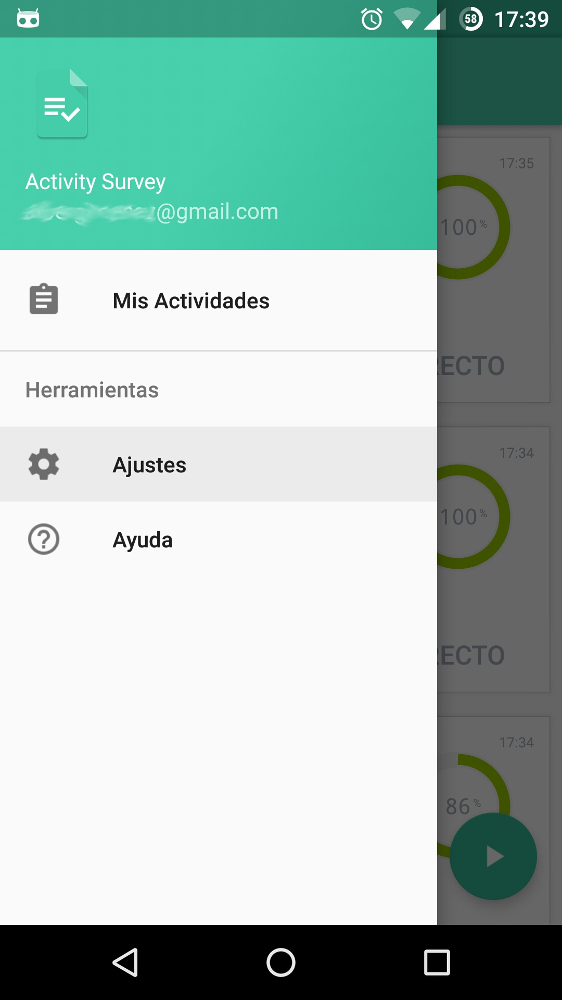

   Acceso a la configuración

En esta actividad muestra el detalle de los datos enviados al servidor de encuesta además de las opciones
de configuración como:

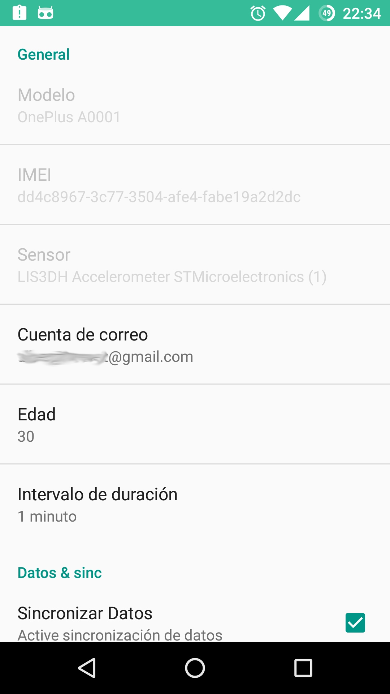

   Configuración general

Correo y Edad
-------------

Para cambiar la configuración inicial del correo y edad accede las opciones.

+----------------------+----------------------+
| Cambiar correo       | Cambiar edad         | 
+======================+======================+
| |step_1|             | |step_2|             |
+----------------------+----------------------+

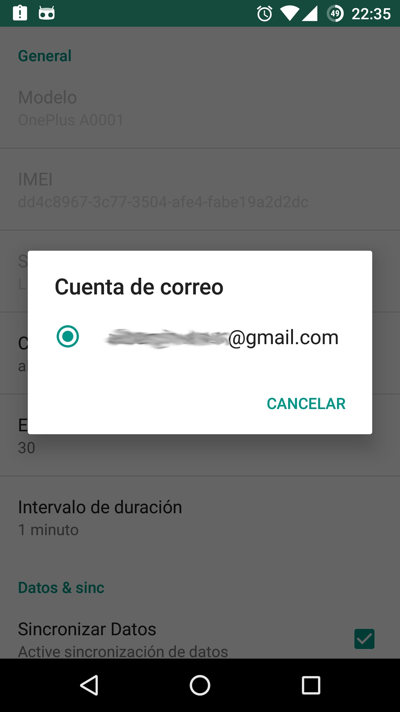

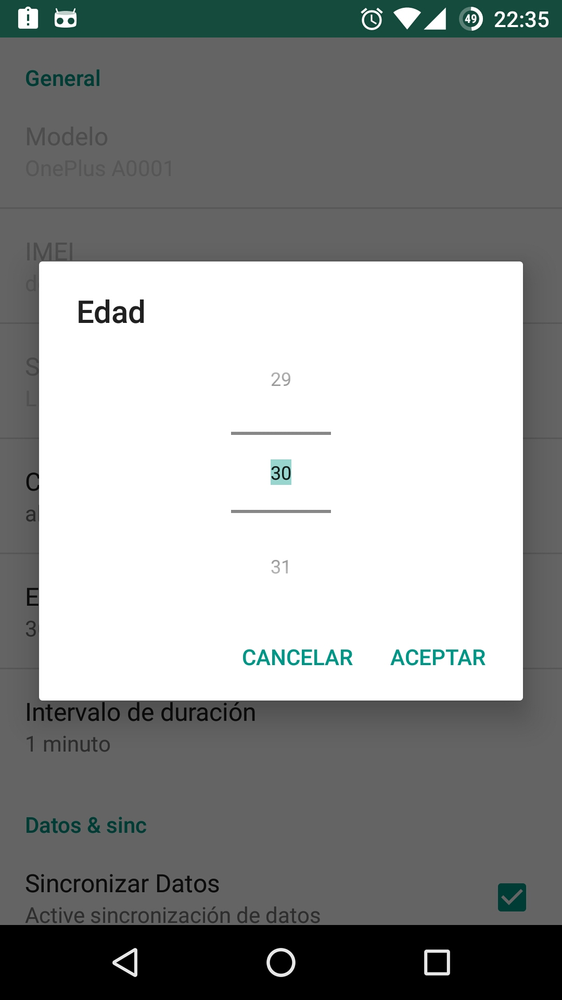

Intervalo
---------

Para cambiar la configuración del intervalo accede a la opción.

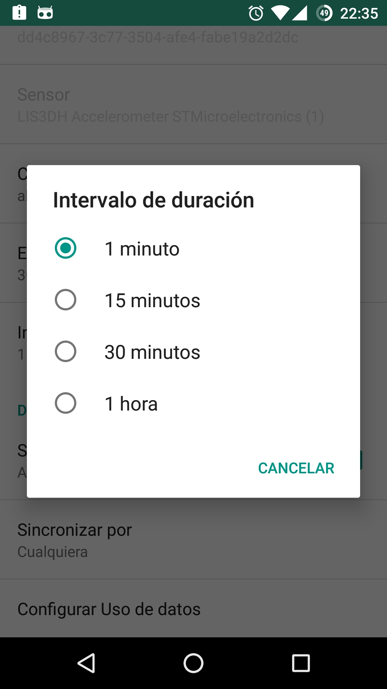

   Cambiar intervalo

Sincronización de datos
-----------------------

Para cambiar la manera en que la aplicación envia los datos por WIFI o redes móviles accede a la opción.

+----------------------+----------------------+
| Acceso a Sincronizar | Cambiar Sincronizar  | 
+======================+======================+
| |step_3|             | |step_4|             |
+----------------------+----------------------+

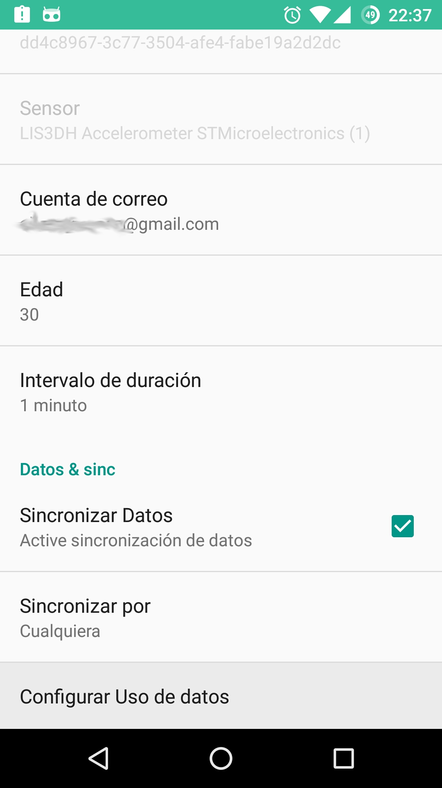

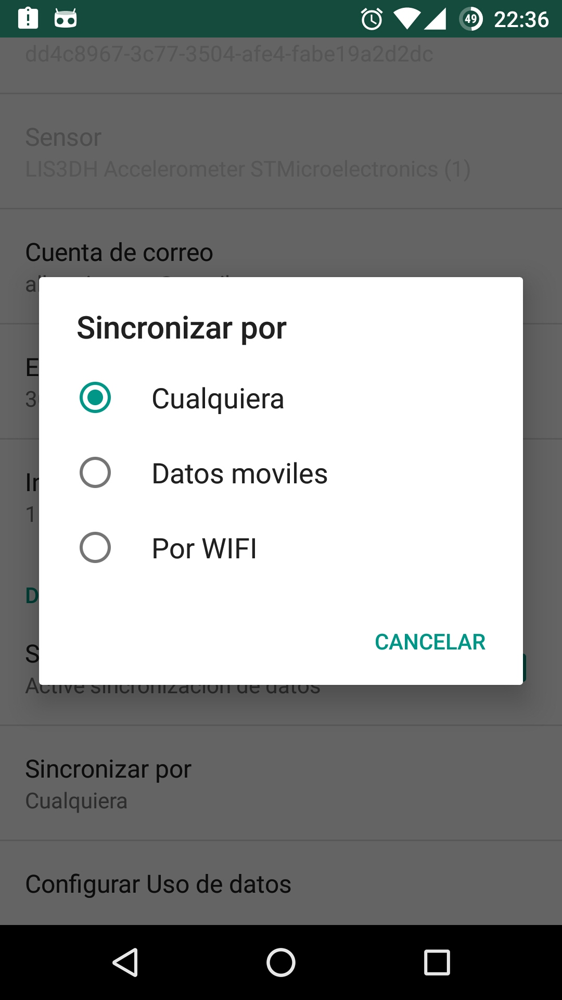

Ayuda
=====

Para acceder a esta página de ayuda desde la aplicación accedé al ``Menu > Ayuda``.

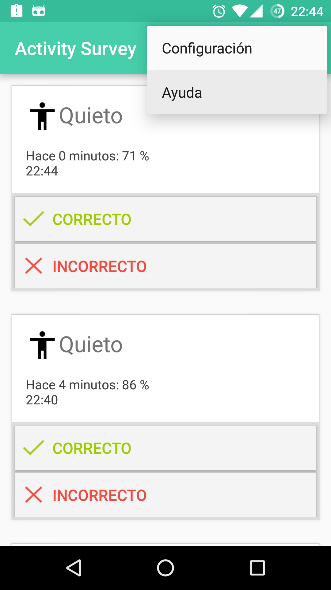

   Acceso a la ayuda

