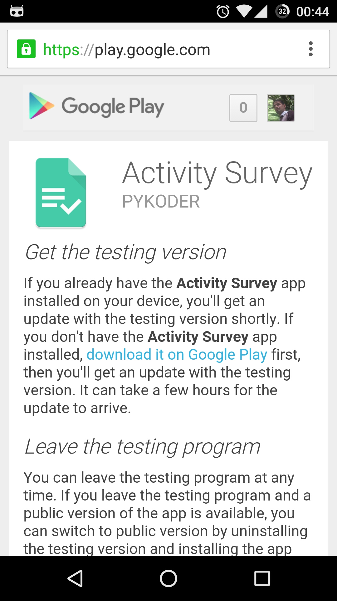
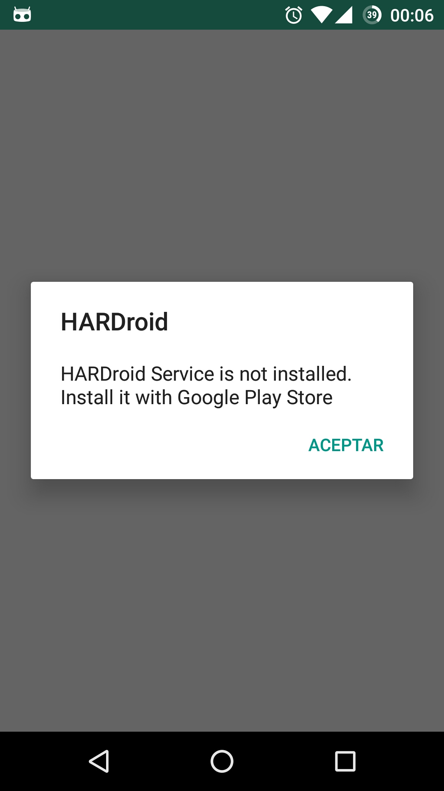

.. title:: 
    Primeros Pasos

.. _har-first:

############## 
Primeros Pasos
############## 

Instalar las Apps 
=================

El proyecto se compone de dos (2) aplicaciones Android que se comunican por medio de el protocolo IBINDER de manera a
independizar las funciones de encuesta y servicio de reconocimiento.

.. image:: _static/archi_ipc.png
   :scale: 50%

Para contribuir con la recolección de datos sigue los pasos para instalar en tu celular las aplicaciones.

.. _har-survey:

Instalar la Encuesta
---------------------

Para instalar la aplicación :term:`Activity Survey` de encuesta accede a este URL `<https://goo.gl/GjmMl3>`_ o por medio de la siguiente
imagen:

.. image:: _static/qr_url.svg

Registrate con tu cuenta de Google y acepta ser un *beta tester*.

Instalar el Reconocedor
-----------------------

Luego de instalar y configurar por primera vez (vease :ref:`har-config`), la applicación *Activity Survey* 
te guiará a la instalación del reconocedor publicado en *Google Play Store*.

