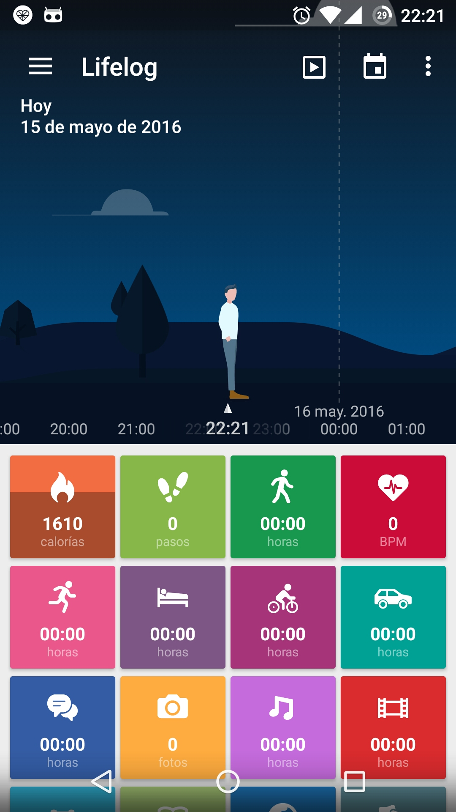
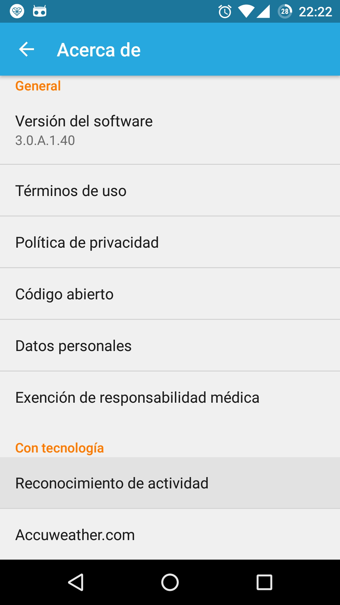
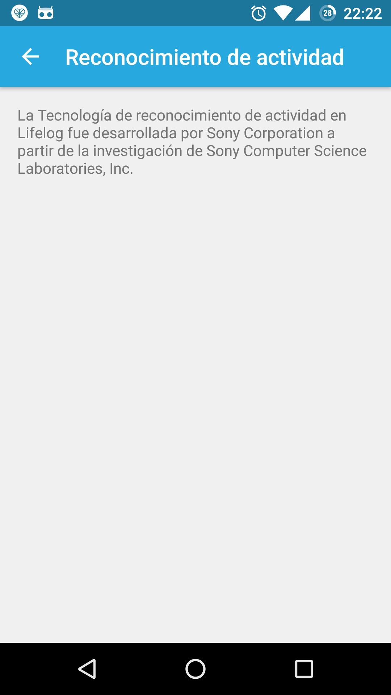

.. title:: ¿Qué es HARDroid?

.. _har-intro:

#################
¿Qué es HARDroid?
#################

HARDroid
========

*HARDroid* es un proyecto *Open Source* que tiene como objetivo tener una implementación abierta del servicio de
reconocimiento de actividades físicas utilizando sensores del celular.

Nuestro proyecto implementa el concepto de desacomplamiento de una Librería API y una APK de servicio que provee la
funcionalidad de reconocimiento de actividades físicas.

La idea nace de dos (2) productos similares de Google y Sony que realizan reconocimiento de actividades los cuales son
:ref:`har-google-play-services` y :ref:`har-life-log`.

.. _har-google-play-services:

Google Play Services
====================

Google dispone del producto `Google Play Services <https://play.google.com/store/apps/details?id=com.google.android.gms&hl=en>`_
que proporciona dentro de una :term:`APK` la implementación de algoritmos, y además los desarrolladores de aplicaciones
Android pueden integrarse (a través de una `API <https://developers.google.com/android/guides/overview>`_) a varias
funcionalidades utilitarias en las siguientes dimensiones:

    Location & Context
        Provee funcionalidades para mejorar la precisión y calidad de la ubicación GPS del celular basado en sensores.
        Además, la función *contexto* provee la capacidad de reconocer las actividades físicas
    Ads
        Provee funcionalidades para ofrecer publicidad in la aplicación
    Games
        Provee funcionalidades para Gamificar la aplicación
    Cloud Messaging
        Provee funcionalidades para mensajería a travéz de Internet.

    |google-services|

.. |google-services| image:: https://developers.google.com/android/images/play-services-diagram.png

.. _har-life-log:

Sony LifeLog
============

Sony dispone de un producto registrar las actividades diarias de las personas por medio de sensores
del celular o por medio de las relojes *smartwatch*. Para esto proveen una aplicación de rastreo de actividades
diarias con un reconocedor de actividades propio.

+-----------------------+-----------------------+-----------------------+ 
| Inicio LifeLog        | Configuración         | Acerca del Reconocedor| 
+=======================+=======================+=======================+ 
| |lflog_1|             | |lflog_2|             | |lflog_3|             | 
+-----------------------+-----------------------+-----------------------+ 

